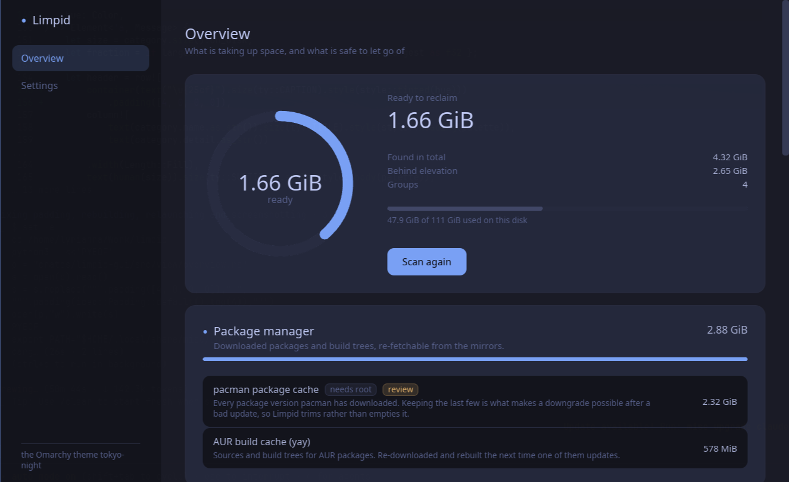
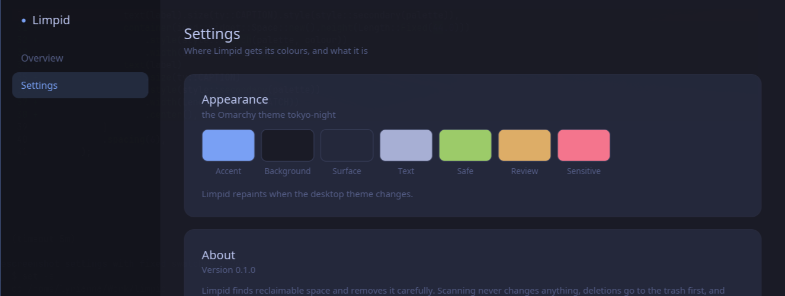

# Limpid

A system cleaner and disk-space analyser for Linux, in the spirit of CCleaner
and CleanMyMac — but one that actually understands the machine it runs on.

Limpid works on any distribution. On [Omarchy](https://omarchy.org) it adopts
the active theme and follows it live when you switch.

> **Status: early development.** The engine is being built in phases; see the
> roadmap below. Nothing here deletes anything yet.



## Why another one

Linux cleaning tools split into two halves that never meet. The analysers are
good at showing where the space went but know nothing about what the files
*mean* — `baobab`, `dust`, `gdu` and `ncdu` will happily point you at a
directory without telling you it is a regenerable cache. The cleaners know the
semantics but are dated and distro-blind — BleachBit is GTK2-era Python and
Stacer is APT-centric, and neither runs `paccache`, surfaces orphan packages,
or has heard of `~/.cache/yay`.

Limpid is one pass that scans, classifies and acts. Three things it does that
nothing else does:

- **Copy-on-write aware.** On btrfs, a file whose extents are pinned by a
  snapshot frees *zero* bytes when deleted. Limpid measures `st_blocks`, not
  apparent size, and says so when snapshots are in play — instead of promising
  gigabytes that never arrive.
- **Arch-native.** The pacman cache, AUR build trees, orphan packages,
  `.pacnew` files and Limine/snapper interactions are first-class, not an
  afterthought bolted onto a Debian model.
- **Reversible by default.** Every destructive action is a dry run until you
  say otherwise, and goes through the XDG trash rather than `unlink`.

## Theming

Limpid reads the active Omarchy palette from the staged theme and follows it
live — the resolver reproduces Omarchy's own alias and derivation cascade, and
agrees with `omarchy-theme-color` on every colour of all 23 themes installed
here.

Off Omarchy it follows the desktop's light/dark preference through
`org.freedesktop.appearance` and uses its own palette. With neither, it just
looks like itself.



```sh
limpid-cli theme                      # the palette in force, and its source
limpid-cli theme --file colors.toml   # resolve a specific theme
```

## Using it

```sh
limpid                       # the application
limpid-cli scan              # what is there
limpid-cli scan --json       # the same, for a script
limpid-cli clean             # what would go, changing nothing
limpid-cli clean --apply     # actually do it
limpid-cli clean --risk review --apply
```

Both front-ends take `--root`, which points the whole engine at a directory
instead of the real filesystem. That is how the test suite runs, and it is a
reasonable way to satisfy yourself about what Limpid does before letting it
near your home directory.

## Safety

An app that deletes files gets one chance to be wrong, so the design gives up
some capability for it:

- **Dry run is the default.** You see the exact list, with real byte counts,
  before anything moves.
- **Removal matches what is being removed.** Caches, build output and package
  archives are deleted outright, because sending a cache to the trash would
  move the bytes to another directory on the same filesystem, free nothing,
  and fill the one place you look to recover things. Anything a person rather
  than a program would have to recreate goes to the freedesktop trash instead.
  Either way the confirmation says which, in those words.
- **Directories are emptied, not removed.** Applications expect their cache
  directory to exist and misbehave quietly when it does not.
- **A second opinion before every removal.** A path is acted on only if it
  sits strictly inside a short list of known directories, is not one of those
  directories itself, contains no `..`, and is not a symlink — checked against
  the filesystem as it is at that moment, not as it was when the plan was
  made. A bug in a scanner should cost a refusal, not a home directory.
- **Split privilege.** The UI never runs as root. System-level cleaning goes
  through a small, auditable helper invoked via polkit, which refuses any path
  outside a compiled-in allowlist.
- **Browsers must be closed.** Limpid refuses rather than warns — cleaning a
  live Chromium profile can make it discard the whole database, not just the
  rows you asked for.
- **No blanket rules.** Removing orphan packages asks per package. `.pacnew`
  files are reported as work to do, never as reclaimable space.

## Roadmap

| Phase | Scope |
|---|---|
| 0 | Foundation: workspace, CI, releases ✓ |
| 1 | Scanning engine and headless CLI ✓ |
| 2 | Theme: Omarchy palette, live reload, standalone fallback ✓ |
| 3 | The application shell ✓ |
| 4 | Safe cleaning: dry run, trash, protected paths ✓ |
| 5 | Browsers: Chromium family and Firefox |
| 6 | Space analyser: treemap, largest items, duplicates |
| 7 | Privileged targets: pacman, journald, coredumps, Docker |
| 8 | Packaging: desktop entry, icon, release binaries, AUR |

## Layout

```
crates/limpid-core     scanning, classification, execution
crates/limpid-theme    palette resolution and live theme reload
crates/limpid-cli      headless front-end, used by the test suite
crates/limpid-gui      the desktop application
crates/limpid-helper   privileged helper, invoked through polkit
```

Nothing that deletes a file lives in the GUI, and what runs as root is kept
small enough to read in one sitting.

## Building

```sh
cargo build --workspace --release
```

## License

MIT
