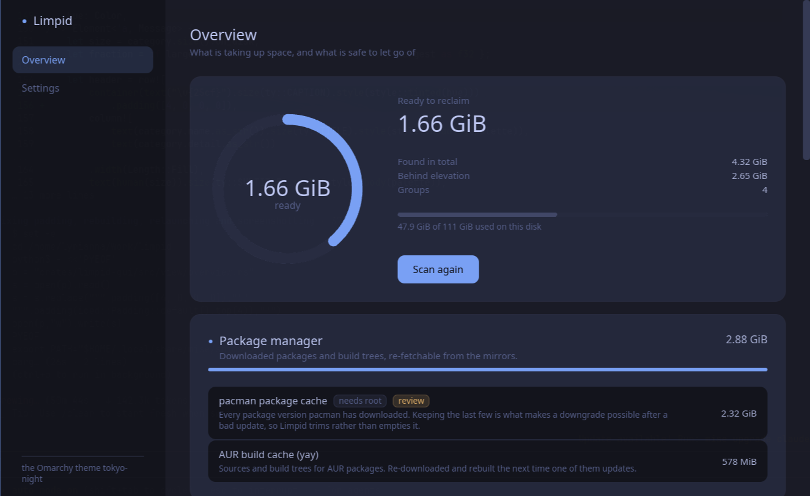
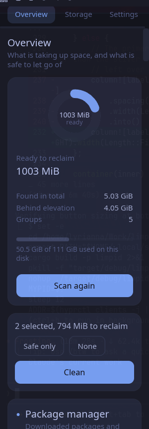
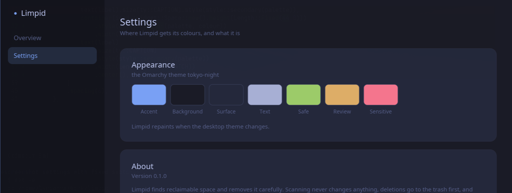
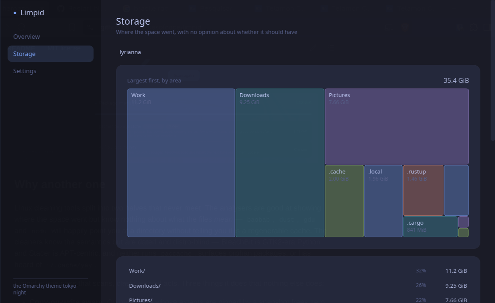

# Limpid

A system cleaner and disk-space analyser for Linux, in the spirit of CCleaner
and CleanMyMac — but one that actually understands the machine it runs on.

Limpid works on any distribution. On [Omarchy](https://omarchy.org) it adopts
the active theme and follows it live when you switch.

> **Status: early development.** The engine is being built in phases; see the
> roadmap below. Nothing here deletes anything yet.



It is built for a tiling window manager, so it does not assume it gets to
pick its own size. The sidebar becomes a row of tabs, the ring and its
figures stack, rows lose their second column and the primary action takes a
line of its own — each at the width where the previous arrangement actually
stops fitting, rather than at a round number.



## Why another one

Linux cleaning tools split into two halves that never meet. The analysers are
good at showing where the space went but know nothing about what the files
*mean* — `baobab`, `dust`, `gdu` and `ncdu` will happily point you at a
directory without telling you it is a regenerable cache. The cleaners know the
semantics but are dated and distro-blind — BleachBit is GTK2-era Python and
Stacer is APT-centric, and neither runs `paccache`, surfaces orphan packages,
or has heard of `~/.cache/yay`.

Limpid is one pass that scans, classifies and acts. Three things it does that
nothing else does:

- **Copy-on-write aware.** On btrfs, a file whose extents are pinned by a
  snapshot frees *zero* bytes when deleted. Limpid measures `st_blocks`, not
  apparent size, and says so when snapshots are in play — instead of promising
  gigabytes that never arrive.
- **It looks in both places a browser hides things.** A Chromium profile
  keeps its HTTP cache under `~/.cache` and a further pile — service workers,
  extension archives, GPU state — inside `~/.config`, next to the bookmarks.
  On the machine this was built on that second half is 200 MB that a tool
  cleaning only `~/.cache` never sees.
- **Arch-native.** The pacman cache, AUR build trees, orphan packages,
  `.pacnew` files and Limine/snapper interactions are first-class, not an
  afterthought bolted onto a Debian model.
- **Reversible by default.** Every destructive action is a dry run until you
  say otherwise, and goes through the XDG trash rather than `unlink`.

## Theming

Limpid reads the active Omarchy palette from the staged theme and follows it
live — the resolver reproduces Omarchy's own alias and derivation cascade, and
agrees with `omarchy-theme-color` on every colour of all 23 themes installed
here.

Off Omarchy it follows the desktop's light/dark preference through
`org.freedesktop.appearance` and uses its own palette. With neither, it just
looks like itself.



```sh
limpid-cli theme                      # the palette in force, and its source
limpid-cli theme --file colors.toml   # resolve a specific theme
```

## Your projects

On a developer's machine the largest thing on the disk is usually build
output: a Rust project's `target/`, a JavaScript project's `node_modules/`.
No list of places can name it, because projects live wherever their authors
put them, so Limpid finds it by a rule. A directory is build output when the
tool left a mark in two places — its manifest beside it (`Cargo.toml`;
`package.json` and a lockfile) and its own evidence inside it (Cargo's
`CACHEDIR.TAG`; npm's or Yarn's install state). A directory that merely has
the name is left alone, and so is anything below a hidden directory, where
applications keep installations that look exactly like projects.

Each project is listed with when it was last worked on, judged by git, by the
project's own files and by the last build. Untouched for three months, it
starts ticked; worked on since, it is listed and waits for you. It is deleted
rather than trashed, because one command brings it back, and a build running
in it stops the removal.

## Where the space went

The catalogue can only find what someone wrote a scanner for. The storage
view knows nothing and finds everything, which is what you want when the
space went somewhere nobody anticipated. Area is proportional to occupied
size; clicking descends.

Files and folders can be ticked there. They go to the trash by default, a
folder whole, so it comes back whole; a file can be deleted outright behind
a second confirmation, a folder cannot yet. A folder that holds your desktop's
settings — `~/.config`, `~/.local/share`, `~/.local/state` — cannot be
chosen at all.



## Using it

```sh
limpid                       # the application
limpid-cli scan              # what is there
limpid-cli scan --json       # the same, for a script
limpid-cli clean             # what would go, changing nothing
limpid-cli clean --apply     # actually do it
limpid-cli clean --risk review --apply
limpid-cli storage                     # where the space went
limpid-cli storage --path ~/Downloads
limpid-cli config                      # what Limpid remembers
limpid-cli exclude ~/.cache/thumbnails # never offer or remove this
limpid-cli exclude --remove ~/.cache/thumbnails
```

## Configuration

The Settings page changes the cleaning policy and lists what is excluded.
Tick something on the Overview or in the storage view and choose **Exclude**
to stop Limpid offering it; an undo appears beside it. All of it lives in
`~/.config/limpid/config.toml`, created the first time something is saved,
which is meant to be edited by hand as much as through Limpid:

```toml
version = 1

[policy]
# Versions of each package pacman keeps for downgrading.
keep_package_versions = 3
# Days of system journal kept.
keep_journal_days = 14

[exclude]
paths = [
    "~/.cache/thumbnails",
    "~/Projects/keep-this",
]
```

An excluded path is never offered and never removed — including when it sits
inside a directory Limpid is emptying, in which case everything around it
goes and it stays. The storage view still counts it, because a total that
left it out would lie about where the space is.

Saving touches only the settings that changed: your comments, your order and
any setting you did not change stay exactly as you wrote them. A typo in one
setting costs that setting, with a warning, not the whole file. A file that
is not valid TOML, or that a newer Limpid wrote, is read as the defaults and
never overwritten.

Both front-ends take `--root`, which points the whole engine at a directory
instead of the real filesystem. That is how the test suite runs, and it is a
reasonable way to satisfy yourself about what Limpid does before letting it
near your home directory.

## Safety

An app that deletes files gets one chance to be wrong, so the design gives up
some capability for it:

- **Dry run is the default.** You see the exact list — every folder that will
  be emptied and every file that will go — with real byte counts, before
  anything moves.
- **"Ready" means ready.** The figure on the Overview is what the default
  selection would remove, and nothing else. What needs your decision, what is
  open in another program and what needs your password are counted apart, and
  the four add up to everything found.
- **A plan out of proportion is not waved through.** Removing more than a
  quarter of everything stored on the disk is sometimes right — one project's
  build output can be that — and it is also what a bug would look like. So it
  waits until you say you have read the list, and the CLI wants
  `--accept-large`.
- **Removal matches what is being removed.** Caches, build output and package
  archives are deleted outright, because sending a cache to the trash would
  move the bytes to another directory on the same filesystem, free nothing,
  and fill the one place you look to recover things. Anything a person rather
  than a program would have to recreate goes to the freedesktop trash instead.
  Either way the confirmation says which, in those words.
- **Directories are emptied, not removed.** Applications expect their cache
  directory to exist and misbehave quietly when it does not.
- **A second opinion before every removal.** A path is acted on only if it
  sits strictly inside a short list of known directories, is not one of those
  directories itself, contains no `..`, and is not a symlink — checked against
  the filesystem as it is at that moment, not as it was when the plan was
  made. A bug in a scanner should cost a refusal, not a home directory.
- **Split privilege, and no path crosses it.** The UI never runs as root.
  System-level cleaning goes to a small helper invoked through polkit, and the
  request it accepts is a fixed set of named operations with bounded
  parameters — "keep the three newest versions of each package", not "remove
  these files". There is no request that means "remove this path", so there is
  no request that can be bent into meaning "remove that one". The helper has
  no filename parsing, no symlink resolution and no safety judgements in it at
  all; those live on the unprivileged side, where being wrong is survivable.
- **Browsers must be closed.** Limpid refuses rather than warns, and finds
  out by walking `/proc/*/fd` rather than by reading a lock file — a lock
  file survives a crash and would report a browser that is not running.
  Cleaning a live Chromium profile does not free the space while the
  descriptors are open, and can make it discard the whole database rather
  than the part you asked for.
- **Some files are protected by name, wherever they appear.** `Local State`
  above all: it holds the wrapped key every saved cookie and password is
  encrypted with, so removing it leaves every row intact and permanently
  undecryptable.
- **No blanket rules.** Removing orphan packages asks per package. `.pacnew`
  files are reported as work to do, never as reclaimable space.
- **Build output is found by a rule, and the rule is asked again** at the
  moment of removal, like everything else: a `Cargo.toml` deleted since the
  scan and the `target/` beside it is no longer build output.
- **An exclusion is a refusal, not a filter.** The scanners leave excluded
  paths out, and the executor refuses them too, so a selection made before
  the exclusion was added still cannot remove what was excluded.

## Roadmap

Built so far: the scanning engine and CLI, the desktop theme with live
reload, the application, safe cleaning, browsers, the storage view and its
treemap, pacman, journald and coredumps through the privileged helper,
acting on files from the storage view, and release binaries with a
PKGBUILD.

| Release | What it adds |
|---|---|
| 0.4 | Settings and exclusions ✓ · project build artifacts · folders in the storage view · the first AUR release |
| 0.5 | History of every run, and undo |
| 0.6 | Duplicate files · large files nobody has opened in years |
| 0.7 | Exact accounting: what a removal really frees on btrfs, and a check afterwards |
| 0.8 | Reclaiming space without deleting anything: deduplication, recompression, snapshot thinning |
| 0.9 | A declarative catalog, and many more applications |
| 0.10 | Automatic maintenance, other distributions, Flathub |

## Layout

```
src/                   the desktop application
crates/limpid-core     scanning, classification, execution
crates/limpid-theme    palette resolution and live theme reload
crates/limpid-cli      headless front-end, used by the test suite
crates/limpid-helper   privileged helper, invoked through polkit
```

Nothing that deletes a file lives in the GUI, and what runs as root is kept
small enough to read in one sitting.

## Installing

From the AUR, once released:

```sh
yay -S limpid
```

Or from source:

```sh
mise run build
sudo ./mise-tasks/install
```

The install task is a plain script, so it runs under `sudo` without mise
being installed for root; `mise run install` works too when the prefix is
writable. It puts `limpid` and `limpid-cli` in `/usr/bin`, the privileged
helper in `/usr/lib/limpid` — it is not a command anyone should run directly,
and the polkit policy names that exact path — and the policy, desktop entry
and icon where the desktop expects them. `./mise-tasks/uninstall` takes it all
back out.

Only `PREFIX=/usr` is supported, and the install task refuses anything else.
The application looks for the helper at that exact path, the polkit policy
authorises only that path, and polkit reads policies only from `/usr/share`
— installed anywhere else, Limpid would open normally and every operation
needing root would quietly fail. `DESTDIR` works as usual for staging a
package. The uninstall task accepts any `PREFIX`, so an older install under
`/usr/local` can still be removed.

`paccache` (from `pacman-contrib`) is needed for the package-cache operation;
everything else works without it.

## Building

```sh
mise run build   # cargo build --release --workspace --locked
mise run check   # rustfmt, clippy with warnings denied, and the tests
mise run audit   # supply chain, spelling and unused dependencies
```

`mise run audit` needs `cargo-deny`, `cargo-machete` and `typos`:
`cargo binstall cargo-deny cargo-machete typos-cli`.

## License

MIT
